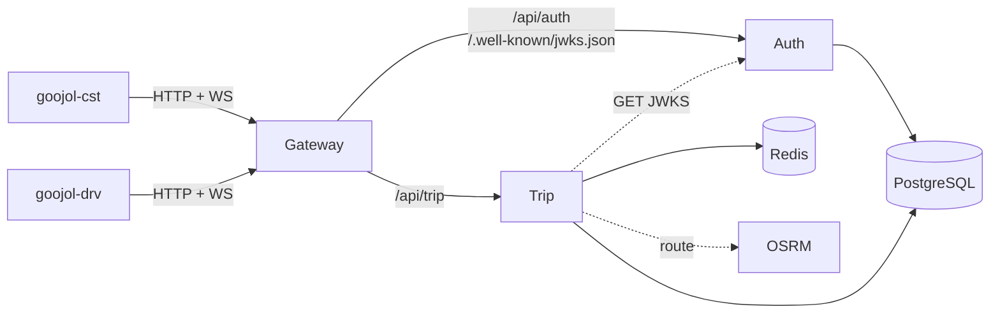
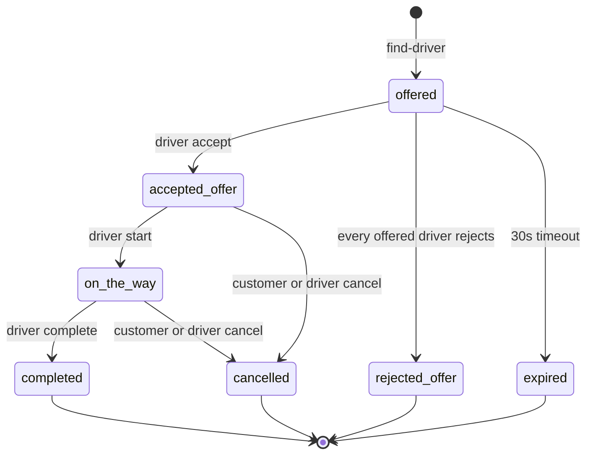
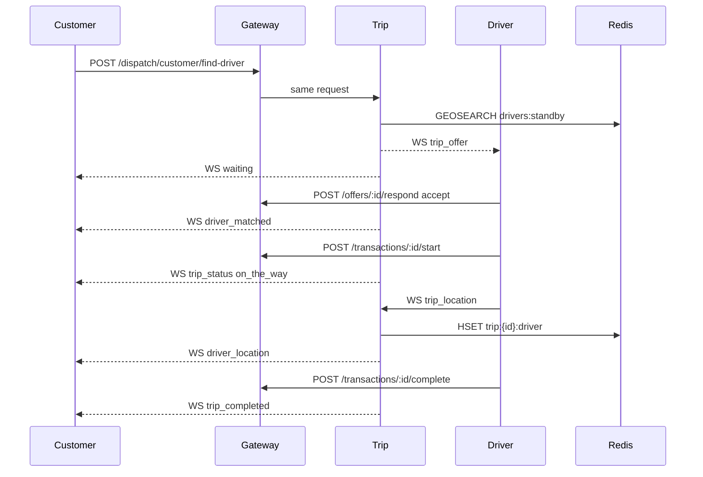
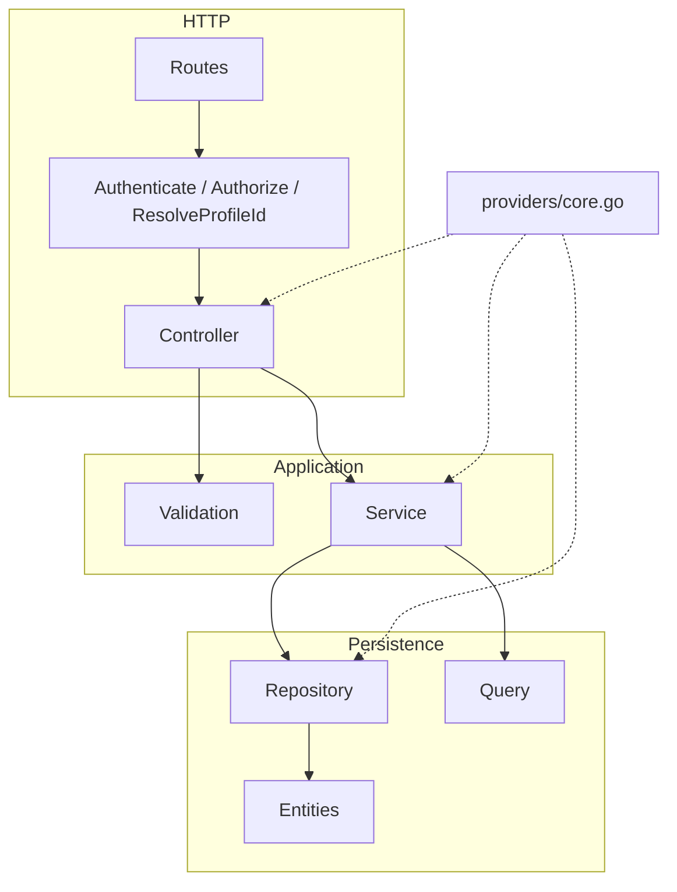
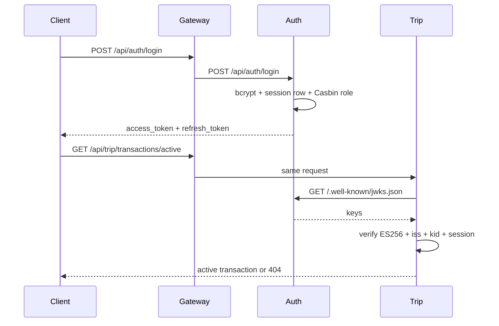
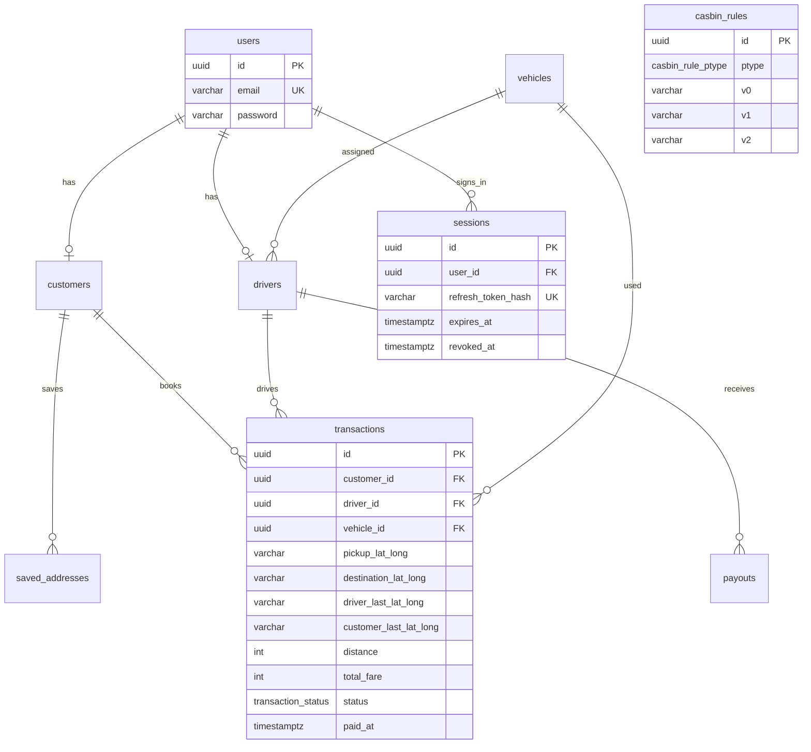

# Architecture

Three Go services behind a path-based gateway, plus two Expo apps. Auth issues ES256 access tokens. Trip (and anyone else) fetches Auth's JWKS and verifies locally. The gateway does not check JWT. It forwards the request, `Authorization` included.

Auth and Trip currently share one Postgres. That is a local-dev shortcut, not a boundary. Auth owns `users`, `sessions`, and `casbin_rules`. Trip owns `transactions` and the live matching loop.

## Stack

| Layer | What we use |
|---|---|
| Language | Go 1.26 |
| HTTP | Gin |
| Gateway | `httputil.ReverseProxy` |
| DI | [`samber/do`](https://github.com/samber/do) |
| ORM | GORM + PostgreSQL (`uuid-ossp`) |
| Authn | JWT ES256 (P-256) + JWKS + server-side sessions |
| Authz | Casbin RBAC (`sub, obj, act`) |
| Validation | `go-playground/validator` |
| Live reload | Air |
| Routing | OSRM (`GET /route/v1/driving/...`) |
| Standby geo | Redis `GEOSEARCH` on `drivers:standby` |
| Trip positions | Redis hashes `trip:{id}:driver` / `trip:{id}:customer` |
| Clients | Expo 56, NativeWind, MapLibre + OSM raster tiles |
| Location | Expo Location |

Not in the product yet: address search (Photon or otherwise), push, a real payment provider. Completing a trip stamps `paid_at` and that is the whole settlement story.

A local Indonesia OSRM graph lives under `backend/trip/docker/osrm` and publishes host port 5001. Trip still defaults to `https://router.project-osrm.org` because `providers/core.go` passes an empty base URL. Point it at `http://127.0.0.1:5001` before you rely on Jakarta routes staying up.

## Topology

Clients talk only to the gateway. Auth publishes keys at `/.well-known/jwks.json`. Trip caches that document for 5 minutes, then checks `alg`, `kid`, `iss`, and that the `session_id` claim is still an unrevoked row in `sessions`.



Each process binds `GOLANG_PORT` (fallback `8888`). `APP_ENV=localhost` binds `0.0.0.0`. HTTP fixtures in `tests/http` assume the gateway at `http://localhost:8001`, so give Auth and Trip different ports and point the gateway at those URLs.

### Gateway routing

Configured in `backend/gateway/cmd/main.go`. Needs `AUTH_SERVICE_URL` and `TRIP_SERVICE_URL`.

| Upstream | Paths |
|---|---|
| `AUTH_SERVICE_URL` | `/.well-known/jwks.json`, `/api/auth`, `/api/auth/*path` |
| `TRIP_SERVICE_URL` | `/api/trip`, `/api/trip/*path` |

`Rewrite` (`SetURL` + `SetXForwarded`) keeps path, method, body, and headers. WebSocket upgrades go through the same `Any` routes. User CRUD is under `/api/auth/user`, not `/api/user`.

## Clients

`frontend/goojol-cst` is the customer app. `frontend/goojol-drv` is the driver app. Both hit `EXPO_PUBLIC_API_URL` over HTTP and `EXPO_PUBLIC_WS_URL` for dispatch sockets. Access tokens go out as `Authorization: Bearer` on HTTP and as the WebSocket subprotocol on upgrade (`new WebSocket(url, [accessToken])`). Axios refreshes on 401 via `POST /api/auth/refresh`.

Customer book flow: pick pickup/drop on a MapLibre map (or a saved address), quote via `calculate-argo`, search via `find-driver`, then sit on `/book/trip` once a driver accepts. `ActiveTripRecovery` reopens that screen if the process dies mid-ride.

Driver standby flow: go online, receive `trip_offer`, accept or reject, start, complete. The same socket carries customer GPS after match.

## Ride lifecycle

A transaction is born in dispatch, then the trip module owns status changes.



`pending` is still in the Postgres enum from the original table. Live matching never writes it.

1. Customer `GET /api/trip/dispatch/customer/calculate-argo` with repeated `pickup_loc` / `destination` query pairs. Trip asks OSRM, then prices each distinct `(vehicle_type, max_size)` from `vehicles`. Motorcycle is Rp 2.500/km, car Rp 4.500/km, plus 2% per extra seat and a 10% platform cut.
2. Customer `POST /api/trip/dispatch/customer/find-driver` with pickup, destination, `vehicle_type`, `max_size`. Redis geo lookup, 3 km, 10 results, filtered to matching vehicles. If nobody is around the customer gets `no_drivers` on their socket and an empty `drivers` array.
3. Otherwise Trip inserts a row at `offered` and pushes `trip_offer` to those drivers (30s TTL). The customer gets `waiting`. Pending offers live in process memory. A Trip restart drops them; the row can still expire in Postgres.
4. Driver `POST /api/trip/dispatch/driver/offers/:id/respond` with `accept` or `reject`. First accept claims the row (`accepted_offer`), assigns driver and vehicle, pulls the winner off standby, tells the customer `driver_matched`, and tells the rest `offer_taken`. If every pending driver rejects, status becomes `rejected_offer` and the customer gets `offer_rejected`. Timeout writes `expired`.
5. Customer can send `{ "type": "retry" }` on the customer socket. That reruns the last search unless an offer is still live.
6. Driver `POST /api/trip/transactions/:id/start` moves `accepted_offer` → `on_the_way`. Both sockets get `trip_status`.
7. During `accepted_offer` or `on_the_way`, either side sends `{ "type": "trip_location", "transaction_id", "lat", "lng" }`. Trip writes Postgres (`driver_last_lat_long` / `customer_last_lat_long`), Redis hashes with a 24h TTL, and notifies the counterpart (`driver_location` / `customer_location`). `GET /api/trip/transactions/active` prefers Redis when a hash exists.
8. Driver `POST .../complete` moves `on_the_way` → `completed`, sets `paid_at` to now, clears Redis, broadcasts `trip_completed`. Either participant `POST .../cancel` from `accepted_offer` or `on_the_way`.

"Active" means `accepted_offer` or `on_the_way`. Offers do not count. Reopen the app and `GET /transactions/active` is how both clients recover.



## HTTP API

JSON envelope is `{ status, message, data }` from `pkg/utils`. Paginated user list adds pagination metadata. CORS origins come from `CORS_ALLOWED_ORIGINS` (comma-separated). Credentials are allowed.

Guards are JWT + live session, then Casbin. Trip also runs `ResolveProfileId`, which loads `customer` or `driver` from `user_id` and puts the row on context. Admin tokens die there on trip routes. That is on purpose.

### Auth (`/api/auth`)

| Method | Path | Guard |
|---|---|---|
| `GET` | `/.well-known/jwks.json` | public (`Cache-Control: public, max-age=300`) |
| `POST` | `/api/auth/register` | public (`role` is `customer` or `driver`) |
| `POST` | `/api/auth/login` | public, 4 failures / 15 min per IP+email |
| `POST` | `/api/auth/refresh` | public (`refresh_token` body) |
| `POST` | `/api/auth/logout` | JWT + session |
| `POST` | `/api/auth/logout-all` | JWT + session |
| `GET` | `/api/auth/sessions` | JWT + session |
| `DELETE` | `/api/auth/sessions/:id` | JWT + session |
| `GET` | `/api/auth/user` | JWT + `user:read` (paginated) |
| `GET` | `/api/auth/user/me` | JWT + `user:read` |
| `PUT` | `/api/auth/user/:id` | JWT + `user:update` (uses token `user_id`, ignores `:id`) |
| `DELETE` | `/api/auth/user/:id` | JWT + admin + `user:delete` |

Password-reset DTOs exist. There are no routes for them.

### Trip (`/api/trip`)

| Method | Path | Guard |
|---|---|---|
| `GET` | `/protected` | `trip:read` |
| `GET` | `/transactions/active` | profile + `trip:read` |
| `GET` | `/transactions/:id` | profile + `trip:read`, participant only |
| `POST` | `/transactions/:id/start` | driver + `trip:update` |
| `POST` | `/transactions/:id/complete` | driver + `trip:update` |
| `POST` | `/transactions/:id/cancel` | profile + `trip:update` |
| `GET` | `/dispatch/customer/calculate-argo` | customer + `dispatch:read` |
| `POST` | `/dispatch/customer/find-driver` | customer + `dispatch:create` |
| `POST` | `/dispatch/driver/mode` | driver + `dispatch:update` (`online` / `offline`) |
| `POST` | `/dispatch/driver/offers/:transaction_id/respond` | driver + `dispatch:update` |
| `GET` | `/dispatch/ws` | driver + `trip:update` (WebSocket) |
| `GET` | `/dispatch/customer/ws` | customer + `dispatch:create` (WebSocket) |
| `GET/POST/PUT/DELETE` | `/saved-addresses` | customer + `saved_address:*` |

### WebSocket messages

One connection per user per role map. A second connect closes the previous. Driver disconnect removes the geo member. Ping every 30s, 60s pong wait.

Driver client:

```json
{"type":"standby","lat":-6.2088,"lng":106.8456}
{"type":"location","lat":-6.2089,"lng":106.8457}
{"type":"trip_location","transaction_id":"...","lat":-6.21,"lng":106.85}
```

Customer client:

```json
{"type":"retry"}
{"type":"trip_location","transaction_id":"...","lat":-6.21,"lng":106.85}
```

Server types: `standby_ok`, `error`, `trip_offer`, `offer_taken`, `offer_expired`, `waiting`, `driver_matched`, `offer_rejected`, `no_drivers`, `driver_location`, `customer_location`, `trip_status`, `trip_completed`.

Redis standby key is `drivers:standby` (`GEOADD` / `GEOSEARCH` / `ZREM`).

## Module layout

Each Go service is its own module. Features live under `modules/<name>/`. HTTP and GORM stay at the edges. Constructors go in `providers/core.go`.

```
cmd/main.go                 boot Gin, CORS, register module routes
providers/core.go           DI: DB, Redis, JWT/JWKS, Casbin, controllers
modules/<feature>/
  routes.go
  controller/
  validation/
  service/
  repository/
  query/                    list/filter (pagination)
  dto/
  tests/
middlewares/
database/entities
database/migrations         registered up/down, recorded in a `migrations` batch table
database/seeders/
pkg/
script/                     migrate, seed, --script:<name>
```

`make module name=<feature>` scaffolds that tree. Register routes in `cmd/main.go` and constructors in `providers/core.go`.

Auth DI: Postgres → JWT → Casbin → user/session repos → services → controllers.

Trip DI: Postgres → Redis → JWKS verifier → session checker → Casbin → `drivergeo` + `triploc` → dispatch WS hub → dispatch service (also the offer retrier) → trip service (also the `trip_location` handler) → saved-address.



## Authentication

Auth signs with an ECDSA P-256 private key (`JWT_PRIVATE_KEY_PATH`). Algorithm is ES256. Default issuer is `go-ojol-auth` (`JWT_ISSUER`). Key id is `JWT_KID`, or a JWK thumbprint if unset.

| Claim | Source |
|---|---|
| `user_id` | `users.id` |
| `email` | `users.email` |
| `role` | first Casbin grouping role for that email |
| `session_id` | `sessions.id` |
| `iss` | `JWT_ISSUER` |
| `iat` / `exp` | issued now, 15 minutes |

Login returns `access_token`, `refresh_token`, and `role`. The refresh token is opaque, stored as a hash on `sessions`, and lasts 7 days. Refresh rotates it. Logout revokes that session. Logout-all revokes every session for the user.

Trip (`AUTH_JWKS_URL`) verifies `alg=ES256`, `kid`, and `iss`, then `sessions.IsActive`. A revoked session makes a still-unexpired JWT useless. That is the whole point of putting `session_id` on the access token.



## Authorization

Model (`backend/auth/pkg/casbin/rbac_model.conf`):

```
p, <role>, <resource>, <action>
g, <user_email>, <role>
```

Matcher: `g(r.sub, p.sub) && r.obj == p.obj && r.act == p.act`.

Roles: `admin`, `customer`, `driver`. Resources: `user`, `trip`, `dispatch`, `saved_address`. Actions: `create`, `read`, `update`, `delete`.

Policies live in `casbin_rules` via a GORM adapter. Seed JSON under `backend/auth/database/seeders/json/` (`casbin_policies.json`, `casbin_grouping.json`, `casbin_dispatch.json`, `casbin_saved_address.json`). `make seed` loads every `casbin_*.json` file. The CLI `go run cmd/main.go --script:casbin_seed` only rewrites the user/trip policy + grouping files. When you add a `casbin_*` resource, update that script **and** the JSON the seeder actually reads.

Register writes `g, <email>, <customer|driver>` in the same transaction as the user row, then reloads the enforcer.

## Database

GORM entities in `database/entities` are the schema. Migrations call `AutoMigrate` after creating enums. Auth seeders load vehicles, users, and Casbin rules. Trip mirrors a lot of the identity tables so it can join `drivers` / `customers` without a network hop. Treat Auth migrations as the source of truth for users and sessions. Run Trip migrations for transaction columns and enums.



Coordinates are `varchar(40)[]` `[lat, lng]` pairs, not PostGIS. Driver and vehicle FKs on `transactions` are nullable so an `offered` row can exist before anyone accepts.

```sql
create type transaction_status as enum (
  'pending',
  'offered',
  'accepted_offer',
  'rejected_offer',
  'on_the_way',
  'completed',
  'expired',
  'cancelled'
);

-- last_lat_long was renamed; customer GPS and settlement time came later
alter table transactions rename column last_lat_long to driver_last_lat_long;
alter table transactions add column customer_last_lat_long varchar(40)[];
alter table transactions add column paid_at timestamptz;

create table sessions (
  id uuid primary key default uuid_generate_v4(),
  user_id uuid not null references users(id) on delete cascade,
  refresh_token_hash varchar(64) unique not null,
  expires_at timestamptz not null,
  revoked_at timestamptz,
  user_agent varchar(512),
  ip varchar(64),
  created_at timestamptz,
  updated_at timestamptz
);
```

Passwords are bcrypt-hashed in `User.BeforeCreate`. Register hashes again before insert. Both paths still work. The double hash is wasteful, not required.

Batch migrations land in a `migrations` table (`name`, `batch`). From a service directory:

```
make migrate          # --migrate:run
make seed             # --seed
make migrate-status
make migrate-rollback
```

## Environment

| Variable | Used by | Purpose |
|---|---|---|
| `GOLANG_PORT` | all | Listen port (default `8888`) |
| `APP_ENV` | all | `localhost` binds `0.0.0.0` |
| `CORS_ALLOWED_ORIGINS` | all HTTP | Comma-separated origins |
| `DB_HOST` `DB_PORT` `DB_USER` `DB_PASS` `DB_NAME` | auth, trip | Postgres |
| `JWT_PRIVATE_KEY_PATH` | auth | PEM ECDSA P-256 private key |
| `JWT_ISSUER` | auth, trip | Token issuer (default `go-ojol-auth`) |
| `JWT_KID` | auth | Optional key id |
| `AUTH_SERVICE_URL` | gateway | Auth upstream |
| `TRIP_SERVICE_URL` | gateway | Trip upstream |
| `AUTH_JWKS_URL` | trip | Full JWKS URL, usually `http://<auth>/.well-known/jwks.json` |
| `REDIS_ADDR` | trip | Redis host:port (default `localhost:6379`) |
| `REDIS_PASSWORD` | trip | Optional Redis password |
| `REDIS_DB` | trip | Redis logical DB (default `0`) |
| `UPLOADTHING_TOKEN` | auth | Profile image uploads |
| `EXPO_PUBLIC_API_URL` | both apps | Gateway HTTP origin |
| `EXPO_PUBLIC_WS_URL` | both apps | Gateway WS origin (`ws://` or `wss://`) |

Each service loads `.env` via `godotenv`. Dockerfiles under `backend/<service>/docker` run Air. There is no repo-root compose file.
