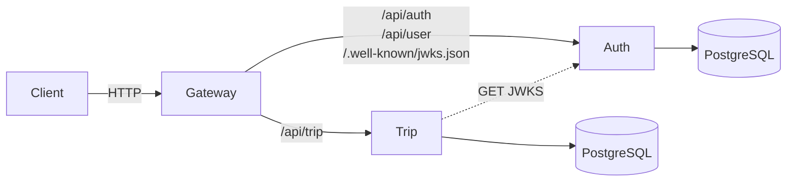
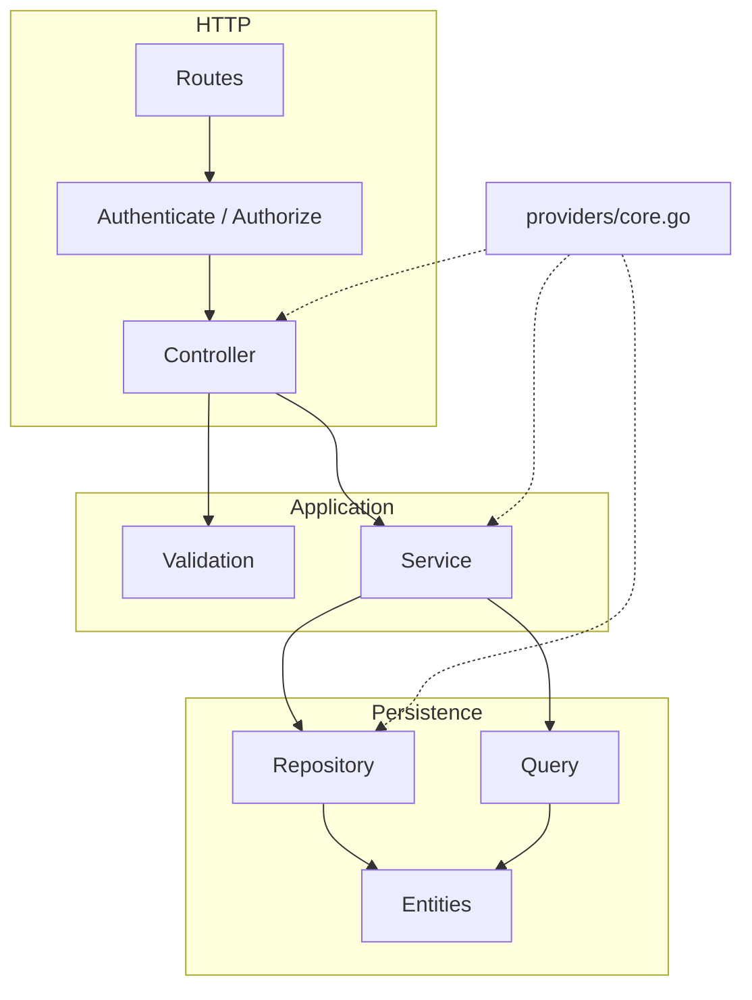
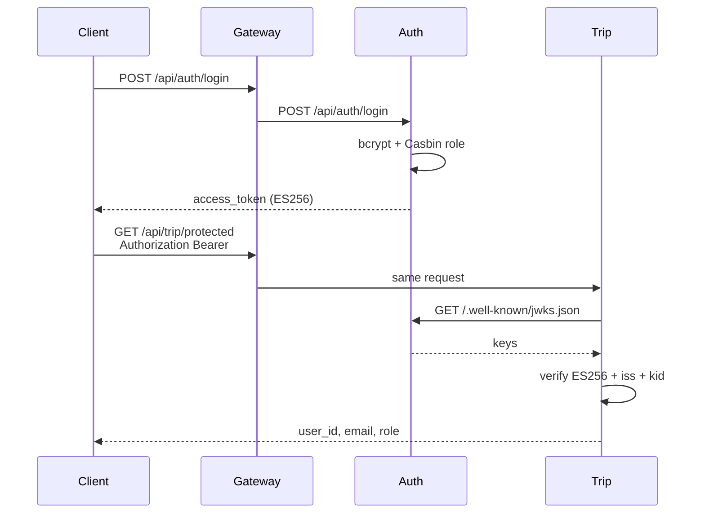
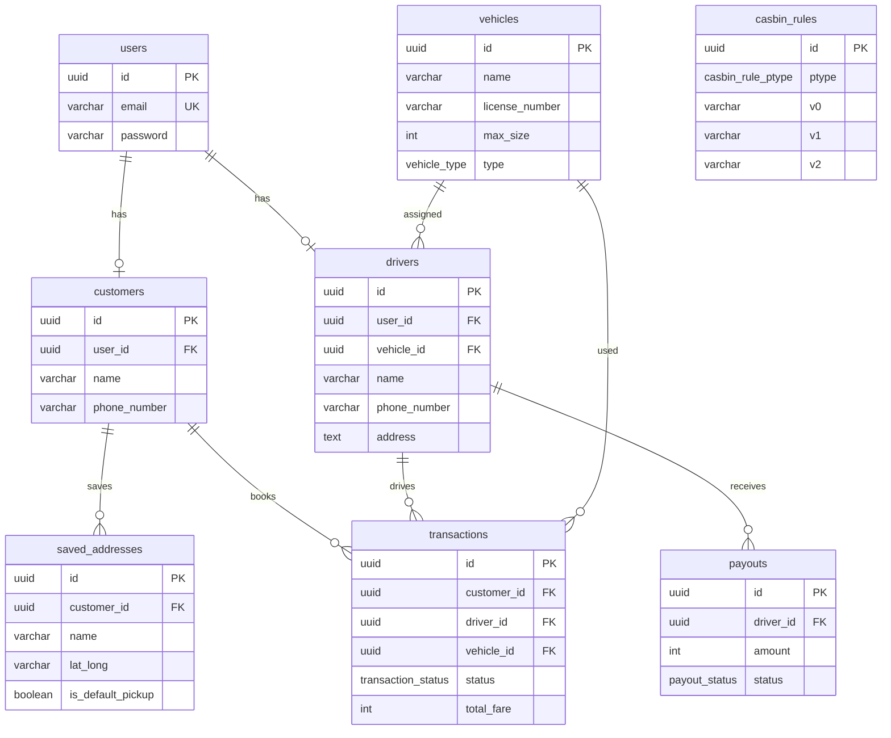

# Architecture

Ride-hailing backend (`go-ojol`): three Go/Gin services behind a reverse-proxy gateway. Auth is the identity issuer. Other services verify access tokens from Auth’s JWKS. Each service is its own Go module and follows the same clean-architecture layout.

## Stack

### Implemented (this repo)

| Layer | Choice |
|---|---|
| Language | Go 1.26 |
| HTTP | Gin |
| Gateway | `httputil.ReverseProxy` |
| DI | [`samber/do`](https://github.com/samber/do) |
| ORM | GORM + PostgreSQL (`uuid-ossp`) |
| Authentication | JWT ES256 (P-256) + JWKS |
| Authorization | Casbin RBAC (`sub, obj, act`) |
| Validation | `go-playground/validator` |
| Live reload | Air |

### Product targets (not in this repo yet)

| Layer | Choice |
|---|---|
| Maps | MapLibre + OSM |
| Location | Expo Location |
| Routing | OSRM |
| Geocoding | Photon (self-hostable) |
| Realtime | WebSocket |
| Cache / live tracking | Redis |
| Payment | Midtrans / dummy |
| Push | Expo Notifications |
| Client | Expo |

## System topology

Clients talk only to the gateway. The gateway does not verify JWT; it forwards `Authorization` and other hop-by-hop headers to the upstream. Auth publishes public keys at `/.well-known/jwks.json`. Trip fetches that document and verifies tokens locally.



Each service reads its own `DB_*` env, but Auth and Trip shared one Postgres. Auth is the source of truth for `users` and `casbin_rules`. Trip currently authenticates from JWT claims only (`user_id`, `email`, `role`).

## Services

| Service | Module | Role |
|---|---|---|
| Gateway | `backend/gateway` | Path-based reverse proxy. No database. |
| Auth | `backend/auth` | Register / login, JWKS, user CRUD, Casbin. |
| Trip | `backend/trip` | Downstream consumer of Auth JWTs. Protected probe endpoint today; trip domain APIs next. |

Default listen address is `GOLANG_PORT` (fallback `8888`). On `APP_ENV=localhost` the bind host is `0.0.0.0`.

### Gateway routing

Configured in `backend/gateway/cmd/main.go`. Requires `AUTH_SERVICE_URL` and `TRIP_SERVICE_URL`.

| Upstream env | Paths |
|---|---|
| `AUTH_SERVICE_URL` | `/.well-known/jwks.json`, `/api/auth`, `/api/auth/*path`, `/api/user`, `/api/user/*path` |
| `TRIP_SERVICE_URL` | `/api/trip`, `/api/trip/*path` |

The proxy uses `Rewrite` (`SetURL` + `SetXForwarded`) so the original path, method, body, and `Authorization` header reach the upstream unchanged.

### API surface

**Auth** (`backend/auth/modules/auth/routes.go`, `backend/auth/modules/user/routes.go`)

| Method | Path | Guard |
|---|---|---|
| `GET` | `/.well-known/jwks.json` | public (`Cache-Control: public, max-age=300`) |
| `POST` | `/api/auth/register` | public (`role` must be `customer` or `driver`) |
| `POST` | `/api/auth/login` | public |
| `POST` | `/api/auth/logout` | public stub (no `Authenticate`; handler expects `user_id`) |
| `GET` | `/api/user` | JWT + Casbin `user:read` (paginated) |
| `GET` | `/api/user/me` | JWT + Casbin `user:read` |
| `PUT` | `/api/user/:id` | JWT + Casbin `user:update` (uses token `user_id`, not `:id`) |
| `DELETE` | `/api/user/:id` | JWT + Casbin `user:delete` (uses token `user_id`, not `:id`) |

**Trip** (`backend/trip/modules/trip/routes.go`)

| Method | Path | Guard |
|---|---|---|
| `GET` | `/api/trip/protected` | JWT via JWKS verifier |

## Clean architecture

Every feature lives under `modules/<name>/`. Dependencies point inward: HTTP → application → persistence. Gin and GORM stay at the edges. Wiring happens in `providers/core.go`, not in controllers.

```
cmd/main.go                 boot Gin, CORS, register module routes
providers/core.go           DI construct DB, JWT/JWKS, Casbin, controllers
modules/<feature>/
  routes.go                 path groups + middleware
  controller/               HTTP bind / status / response envelope
  validation/               request validation
  service/                  use cases
  repository/               GORM writes / lookups
  query/                    list/filter (pagination)
  dto/                      request/response types
  tests/
middlewares/                CORS, Authenticate, Authorize
database/
  entities/                 GORM models
  migrations/               registered up/down (Like laravel)
  seeders/
pkg/                        shared helpers (casbin, jwks, constants, utils)
script/                     CLI: migrate, seed, --script:<name>
```



`make module name=<feature>` (`create_module.sh`) scaffolds that tree. New routes must be registered in `cmd/main.go` and new constructors in `providers/core.go`.

Auth DI (`backend/auth/providers/core.go`): Postgres → JWT service → Casbin enforcer → user/casbin repositories → user/auth services → controllers.

Trip DI (`backend/trip/providers/core.go`): Postgres → JWKS verifier → trip controller.

## Authentication

Auth signs access tokens with an ECDSA P-256 private key (`JWT_PRIVATE_KEY_PATH`). Algorithm is **ES256**. Default issuer is `go-ojol-auth` (`JWT_ISSUER`). Key id is `JWT_KID`, or a JWK thumbprint if unset.

Access token claims:

| Claim | Source |
|---|---|
| `user_id` | `users.id` |
| `email` | `users.email` |
| `role` | first Casbin grouping role for that email |
| `iss` | `JWT_ISSUER` |
| `iat` / `exp` | issued now, **15 minutes** |

The public JWK is served at `GET /.well-known/jwks.json`. Trip (`AUTH_JWKS_URL`) caches keys for 5 minutes, then verifies `alg=ES256`, `kid`, and `iss` before putting `user_id`, `email`, and `role` on the Gin context.

Refresh-token helpers exist on the JWT service (7-day opaque token) but login currently returns only `access_token` and `role`. Refresh and password-reset DTOs have no routes. Logout is a no-op and is not behind `Authenticate`. Casbin runs in Auth only; Trip does not enforce policies.



## Authorization (Casbin)

Model (`backend/auth/pkg/casbin/rbac_model.conf`):

```
p, <role>, <resource>, <action>
g, <user_email>, <role>
```

Matcher: `g(r.sub, p.sub) && r.obj == p.obj && r.act == p.act`.

Roles: `admin`, `customer`, `driver`. Seeded user policies today are on resource `user` with actions `read` / `update` / `delete`. Register writes `g, <email>, <customer|driver>` in the same transaction as the user row, then reloads the enforcer.

Policies live in `casbin_rules` via a GORM Casbin adapter. Seed JSON:

- `backend/auth/database/seeders/json/casbin_policies.json`
- `backend/auth/database/seeders/json/casbin_grouping.json`

CLI: `go run cmd/main.go --script:casbin_seed` (no extra flags). When adding a `casbin_*` resource (e.g. `casbin_trip`), update the script **and** both JSON files.

Auth middleware chain on `/api/user`: `Authenticate(jwt)` then `Authorize(enforcer, resource, action)` using the email from the token.

## Request envelopes

JSON responses use `pkg/utils` builders: `{ status, message, data }` (plus pagination metadata on `GET /api/user`). CORS origins come from `CORS_ALLOWED_ORIGINS` (comma-separated); credentials are allowed.

## Database

GORM entities in `database/entities` are the schema. Migrations call `AutoMigrate` after creating Postgres enums. Auth seeders load vehicles, users, and Casbin rules. Trip currently mirrors the same entity/migration set from the service template; treat Auth as owner of identity tables until Trip domain writes exist.



```sql
create extension if not exists "uuid-ossp";

create table users (
  id uuid primary key default uuid_generate_v4(),
  email varchar(150) unique not null,
  password varchar(255) not null,
  created_at timestamptz,
  updated_at timestamptz
);

create type casbin_rule_ptype as enum ('p', 'g');

create table casbin_rules (
  id uuid primary key default uuid_generate_v4(),
  ptype casbin_rule_ptype not null,
  v0 varchar(255),
  v1 varchar(255),
  v2 varchar(255),
  v3 varchar(255),
  v4 varchar(255),
  v5 varchar(255),
  created_at timestamptz,
  updated_at timestamptz
);

create type vehicle_type as enum ('car', 'motorcycle');

create table vehicles (
  id uuid primary key default uuid_generate_v4(),
  name varchar(150) not null,
  license_number varchar(20) not null,
  max_size int not null check (max_size > 0),
  type vehicle_type not null,
  created_at timestamptz,
  updated_at timestamptz
);

create table drivers (
  id uuid primary key default uuid_generate_v4(),
  user_id uuid not null references users(id) on delete cascade,
  vehicle_id uuid not null references vehicles(id) on delete set null,
  name varchar(255) not null,
  phone_number varchar(15) not null,
  address text not null,
  profile_picture_url text,
  created_at timestamptz,
  updated_at timestamptz
);

create table customers (
  id uuid primary key default uuid_generate_v4(),
  user_id uuid not null references users(id) on delete cascade,
  name varchar(255) not null,
  phone_number varchar(15) not null,
  profile_picture_url text,
  created_at timestamptz,
  updated_at timestamptz
);

create table saved_addresses (
  id uuid primary key default uuid_generate_v4(),
  customer_id uuid not null references customers(id) on delete cascade,
  name varchar(255) not null,
  lat_long varchar(40)[] not null,
  is_default_pickup boolean not null default false,
  created_at timestamptz,
  updated_at timestamptz
);

create type transaction_status as enum ('pending', 'on_the_way', 'completed', 'cancelled');

create table transactions (
  id uuid primary key default uuid_generate_v4(),
  customer_id uuid not null references customers(id) on delete set null,
  driver_id uuid not null references drivers(id) on delete set null,
  vehicle_id uuid not null references vehicles(id) on delete set null,
  pickup_lat_long varchar(40)[] not null,
  destination_lat_long varchar(40)[] not null,
  last_lat_long varchar(40)[] not null,
  distance int not null check (distance > 0),
  fare_per_distance int not null,
  platform_percentage int not null,
  total_fare int not null,
  status transaction_status not null,
  created_at timestamptz,
  updated_at timestamptz
);

create type payout_status as enum ('pending', 'processing', 'cancelled', 'paid', 'failed');

create table payouts (
  id uuid primary key default uuid_generate_v4(),
  driver_id uuid not null references drivers(id) on delete cascade,
  amount int not null,
  status payout_status not null,
  failed_reason text,
  created_at timestamptz,
  updated_at timestamptz
);
```

Passwords are bcrypt-hashed in `User.BeforeCreate` and again in register (service hashes before insert). Coordinates are `varchar(40)[]` pairs, not PostGIS.

Batch migrations are recorded in a `migrations` table (`name`, `batch`). From a service directory:

```
make migrate          # --migrate:run
make seed             # --seed
make migrate-status
make migrate-rollback
```

## Environment

| Variable | Used by | Purpose |
|---|---|---|
| `GOLANG_PORT` | all | Listen port (default `8888`) |
| `APP_ENV` | all | `localhost` binds `0.0.0.0` |
| `CORS_ALLOWED_ORIGINS` | all HTTP | Comma-separated origins |
| `DB_HOST` `DB_PORT` `DB_USER` `DB_PASS` `DB_NAME` | auth, trip | Postgres |
| `JWT_PRIVATE_KEY_PATH` | auth | PEM ECDSA P-256 private key |
| `JWT_ISSUER` | auth, trip | Token issuer (default `go-ojol-auth`) |
| `JWT_KID` | auth | Optional key id |
| `AUTH_SERVICE_URL` | gateway | Auth upstream |
| `TRIP_SERVICE_URL` | gateway | Trip upstream |
| `AUTH_JWKS_URL` | trip | Full JWKS URL (typically `http://<auth>/.well-known/jwks.json`) |

Each service loads `.env` via `godotenv`. Dockerfiles under `backend/<service>/docker` run Air for development; there is no repo-root compose file yet.
